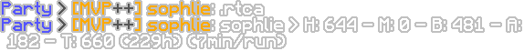

<h1 align="center">
  Kuudraiscool (KIC)
</h1>

  
   
  
  
  
  
    
  <b>Kuudraiscool (KIC)</b> is a <b>Minecraft Forge 1.8.9 mod</b> for <b>Hypixel SkyBlock</b>, originally built to improve the <b>Kuudra gameplay</b>, but now expanded with a growing set of <b>quality-of-life features</b>.  
  This mod started as a simple ChatTriggers module, but has since been rewritten from the ground up in Java as a full Forge mod — giving it more power, performance, and potential.

---

## 🚀 Getting Started

1. 📦 **Install:** Follow the [Installation Guide](./docs/INSTALLING.md).
2. 🔑 **Activate:** Type `/kic apikey <your-api-key>` in-game to link your account.
3. ⚙️ **Set Up:** Use `/kic` or `/kuudraiscool` to open the settings panel.
4. 🧭 **Explore:** Try out the features listed below or access even more in-game.

---

## ✨ Features

### Kuudra-Related Features

- 

    
Kuudra Info (Stats & Items)

    <b>Command:</b> <code>/kuudra &lt;PLAYER&gt;</code>   
    Displays useful kuudra stats for a specified player.   
     

- 

    
Dynamic Waypoints

    Shows you the perfect location and time to throw your pearl so you land on the supply drop location 
       
       

- 

    
Chest Profit Calculator

    Calculates and displays profits of a paid/free chest.   
       

- 

    
Profit Tracker

    <b>Command:</b> <code>/kic resetprofittracker</code> 
    Tracks overall profits from your runs.   
       

- 

    
Auto Kick

    Automatically kicks players based on specific criteria set in the settings.   
       

- 

    
Auto Open Paid Chest

    Automatically opens paid chests.   
       

- 

    
Auto Reroll Paid Chest

    Automatically rerolls paid chests.   
       

- 

    
Build Progress

    Shows a beacon beam which changes color from red to green based on the progress   
       

- 

    
Kuudra HP, Boss Bar and Outline

    Shows Kuudra's health, an outline, and a live-updating boss bar.   
       

- 

    
Supply Hitbox and Waypoint

    Shows a hitbox and a beacon beam on the supply.   
       

- 

    
God Roll Hologram

    Shows a hologram around the paid chest whenever you get a god roll   
       

- 

    
Kuudra Splits

    Shows customizable and accurate Kuudra splits along with supply times and fresh times.   
       
       

### Other Features

- 

    
Attribute Price Checker

    <b>Command:</b> <code>/ap &lt;ATTRIBUTE&gt; [LEVEL] [ATTRIBUTE] [LEVEL]</code>   
    Checks the price of specified attributes (similar to KG bot).   
       

- 

    
Attribute Upgrade

    <b>Command:</b> <code>/au &lt;ITEM&gt; &lt;ATTRIBUTE&gt; &lt;START LEVEL&gt; &lt;END LEVEL&gt;</code>   
    Shows you the cheapest possible path to upgrade an attribute.   
       

- 

    
Attribute Price Auction

    <b>Command:</b> <code>/ka &lt;ATTRIBUTE&gt; [LEVEL] [ATTRIBUTE] [LEVEL]</code>   
    Displays a custom auction house of items for specific attributes. 
     

- 

    
Container Value

    Shows all the items in a container and their value, also shows the total value of the container.   
       

- 

    
Container Helper

    Show your all the attributes in a container.   
       

- 

    
Auction Helper

    When selling an attribute item it will show you the LB and Avg price of each attribute.   
       

- 

    
Attribute Value Tooltip

    Shows you the value of the attributes in the items tooltip.   
       

- 

    
Player Sizing

    Allows you to change the visual size of the player characters.   
       

- 

    
Item Finder

    <b>Commands:</b>    
    <code>/lf &lt;PLAYER&gt; &lt;QUERY&gt;</code>   
    <code>/lf &lt;PLAYER&gt; lore:&lt;QUERY&gt;</code> 
    Finds specific items in your inventory or elsewhere.   
     

- 

    
Chat Commands

    Works in both party and dms 
    - <code>.runs [player]</code>   
         
    - <code>.stats [player]</code>   
         
    - <code>.rtca [player]</code>   
       
    - <code>.ap &lt;attribute&gt; [level]</code>   
       
    - <code>.cata [player]</code>   
         
    - <code>.kic</code>   
       
    - <code>.kick &lt;player&gt;</code>   
         

- 

    
MVP++ Emojis

    Allows usage of MVP++ emojis in chat.   
       

**`[ ]` = optional** 
**`< >` = required**

### ➕ Tons More In-Game!
**What’s shown here is just a sample. To see the complete feature list, head in-game and open the settings panel!**

---

## Commands

### General Commands

- `/attributeprice <attribute> [level] [attribute] [level]` (Aliases: `/ap`, `kicap`)
- `/attributeupgrade <item> <attribute> <start level> <end level>` (Aliases: `/au`, `kicau`)
- `/kicauction <attribute> [level] [attribute] [level]` (Aliases: `/ka`, `kicah`)
- `/kuudra [player]`
- `/t1 - /t2 - /t3 - /t4 - /t5`
- `/lf <player> <query>`
- `/lf <player> lore:<query>`
- `/kc <message>`

### KIC Commands

- `/kic`
- `/kic help`
- `/kic apikey <key>`
- `/kic verifykey`
- `/kic edithuds`
- `/kic chat kc/kcp/mc`
- `/kic kuudra [player]`
- `/kic resetprofittracker`
- `/kic sharetracker`
- `/kic pb`
- `/kic resetpb`
- `/kic ecbp`
- `/kic checkupdates`
- `/kic premium`
- `/kic t1 - t2 - t3 - t4 - t5`

**`[ ]` = optional** 
**`< >` = required**

---

## 📜 License

This project is licensed under the **GNU General Public License v3.0**.  
You’re free to use, modify, and share it — as long as your version stays **open-source** and under the same license.

See [LICENSE](./LICENSE) for full details.

---